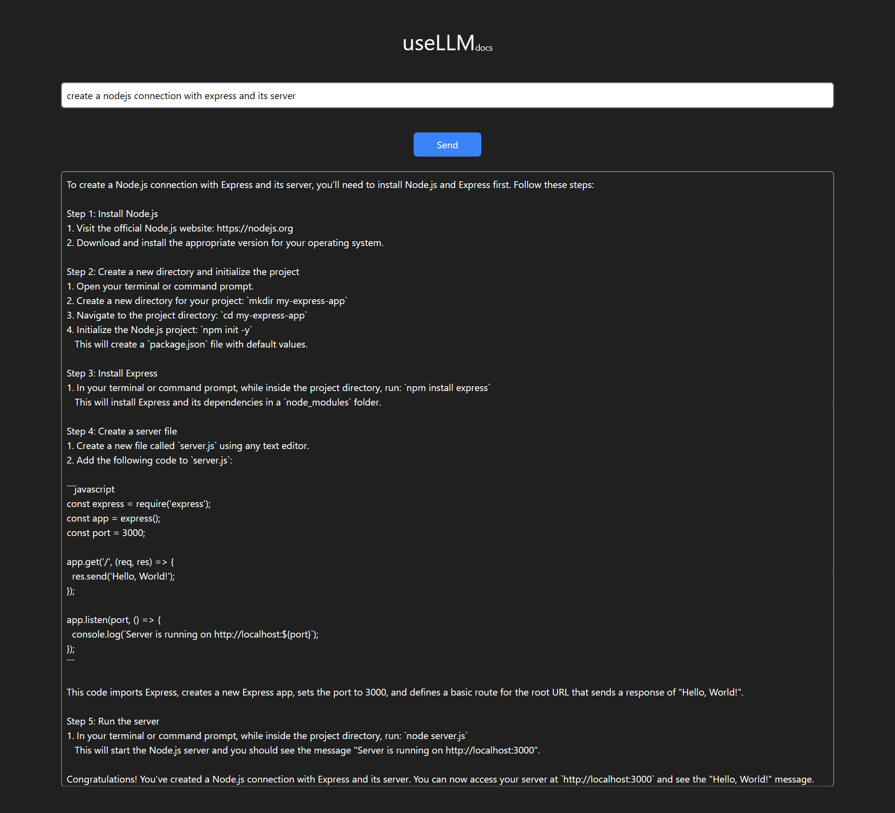

# useLLM Example

This is a React application that uses the `usellm` library to interact with the LLM API. The application allows users to send messages to the LLM API and displays the response.

[Link page Github Pages](https://lace04.github.io/usellm-tutorial/)

## Usage

1. Install dependencies by running `npm install`.
2. Start the development server by running `npm start`.
3. Open [http://localhost:3000](http://localhost:3000) to view the application in your browser.

## Code Explanation

The code imports the `useState` hook from `react`, the `useLLM` hook from `usellm`, and the `PulseLoader` component from `react-spinners`.

The `App` component maintains state for the messages, input value, and loading status using the `useState` hook.

The `useLLM` hook is used to create an instance of the LLM API client with the specified service URL.

The `handleSend` function sends a chat message to the LLM API using the `chat` method of the LLM API client. The function sets the loading state to true, sends the chat message, and updates the messages state with the response from the API. The loading state is set to false once a response is received.

The JSX returned by the `App` component includes an input field for entering messages, a button for sending messages, and a div for displaying messages. The input field is controlled by the `inputValue` state and updates its value when changed. The button calls the `handleSend` function when clicked. The div displays the messages from the `messages` state.

